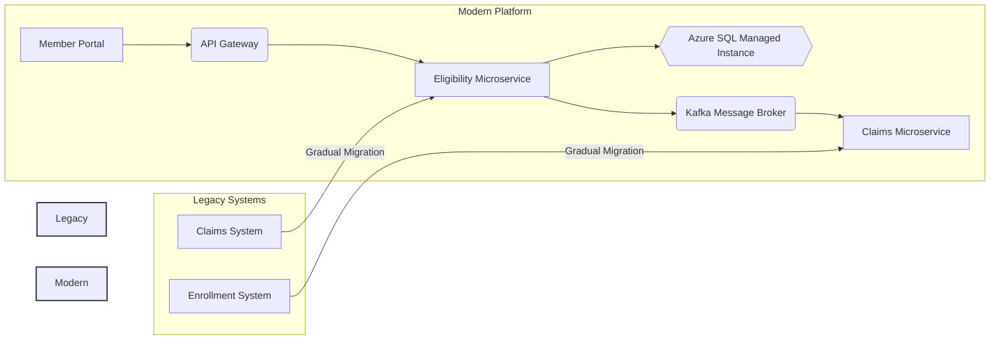
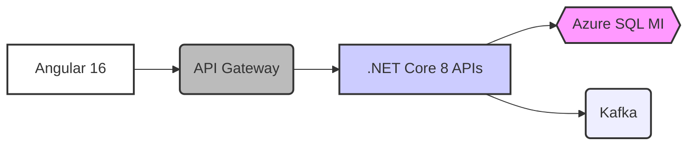
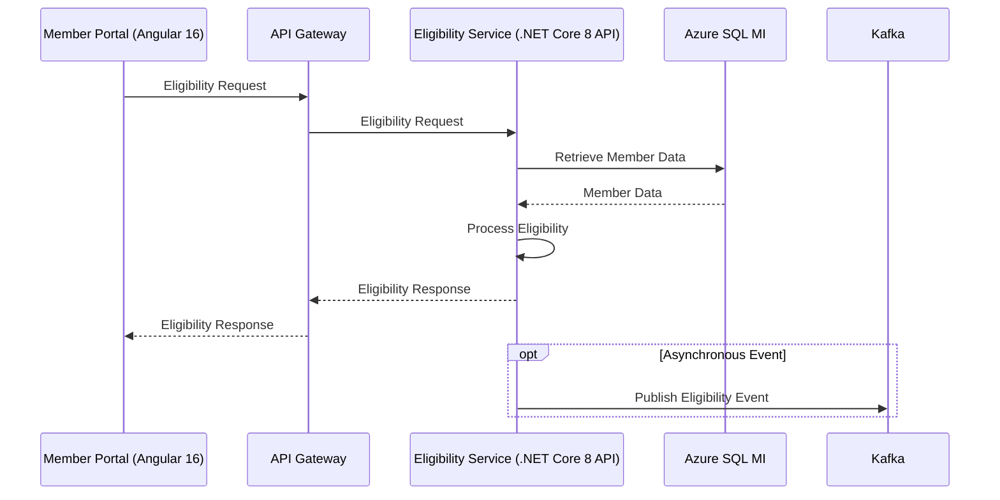
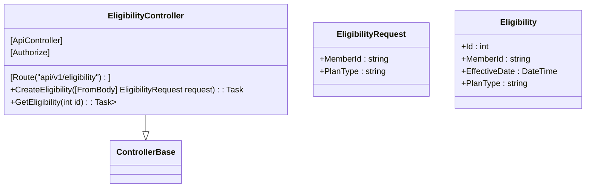
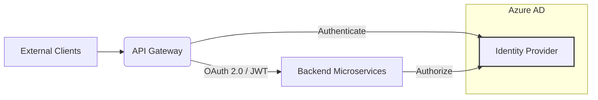
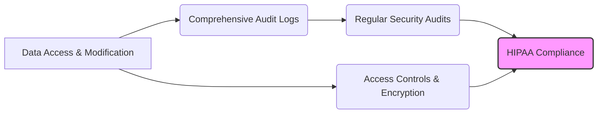

 
## Improved Concept: Secure Healthcare Data Integration Platform for Enhanced Payer Operations

This initiative outlines the modernization of legacy healthcare payer systems (enrollment and claims processing) through a secure, scalable, and compliant cloud-native platform. By leveraging microservices, Azure infrastructure, and FHIR standards, we aim to achieve real-time data accessibility, seamless system transitions, and adherence to stringent HIPAA regulations.

**1. Project Vision**

To transform legacy healthcare payer operations into a modern, efficient, and secure ecosystem, enabling:

* **Real-time Interactions:** Instant eligibility checks and timely claims processing.
* **Seamless Evolution:** Gradual and low-risk migration from existing monolithic systems.
* **Data Interoperability:** Standardized data exchange for improved care coordination and insights.
* **Unwavering Compliance:** Robust security measures and auditability to meet HIPAA requirements.

**Visualization:**



**2. Modern Technical Architecture**

Our architecture leverages a cloud-native, microservices-based approach on Azure, emphasizing scalability, resilience, and security.

**2.1 Component Stack:**

| Layer        | Technology                     | Purpose                                                                 |
| :----------- | :----------------------------- | :---------------------------------------------------------------------- |
| **Frontend** | Angular 16                     | User interface for member interactions and potentially internal tools.   |
| **Backend** | .NET Core 8 APIs               | Business logic and API endpoints for various functionalities.           |
| **Database** | Azure SQL Managed Instance     | Secure and scalable relational database for persistent data storage.     |
| **Messaging**| Kafka                          | High-throughput, fault-tolerant messaging for asynchronous communication. |
| **Security** | OAuth 2.0, Azure Active Directory | Secure authentication and authorization for users and services.         |

**Visualization:**



**2.2 System Flow (Eligibility Check Example):**

1.  A member interacts with the **Member Portal (Angular 16)**.
2.  The portal sends an eligibility request to the **API Gateway**.
3.  The **API Gateway** routes the request to the **Eligibility Microservice (.NET Core 8 API)**.
4.  The **Eligibility Microservice** retrieves member data from **Azure SQL Managed Instance**.
5.  The eligibility status is determined and returned to the **API Gateway**, then back to the **Member Portal**.
6.  Optionally, an event might be published to **Kafka** for other interested services (e.g., logging or analytics).

**Visualization:**



**3. Implementation Strategy**

Our implementation will follow an iterative approach, prioritizing the development and deployment of key microservices while ensuring infrastructure automation and robust security practices.

**3.1 Eligibility Microservice:**

The `EligibilityController.cs` snippet demonstrates a basic endpoint for creating eligibility records. In a real-world scenario, this would involve more complex business logic, data validation, and interaction with other services.

**Visualization (Simplified Class Diagram):**



**3.2 Infrastructure-as-Code (IaC):**

The `eligibility-deployment.yml` snippet showcases a Kubernetes deployment for the eligibility service. IaC using tools like Azure Resource Manager (ARM) templates or Terraform will be crucial for managing and provisioning our Azure infrastructure consistently and repeatably.

**Visualization (Conceptual IaC Pipeline):**

```mermaid
graph TD
    A[Code Repository] --> B(IaC Templates)
    B --> C{ARM/Terraform}
    C -- Apply --> D[Azure Kubernetes Service (AKS)]
    style A fill:#ccf,stroke:#333,stroke-width:2px
    style D fill:#f9f,stroke:#333,stroke-width:2px
```

**3.3 Security Implementation:**

JWT validation, as shown in `Program.cs`, is a key aspect of securing our APIs. We will implement comprehensive security measures, including:

* **Authentication:** Using Azure Active Directory and OAuth 2.0 for secure user and service authentication.
* **Authorization:** Implementing role-based access control (RBAC) to ensure appropriate permissions.
* **Data Encryption:** Encrypting data at rest and in transit using Azure services and best practices.
* **Network Security:** Utilizing Azure Network Security Groups and other network controls to isolate and protect resources.

**Visualization (Simplified Security Layer Diagram):**



**4. Robust DevOps Pipeline**

An automated CI/CD pipeline is essential for efficient and reliable software delivery. Our pipeline will include:

* **Code Commit:** Triggers the pipeline upon code changes.
* **Build:** Compiles code, builds Docker images, and performs vulnerability scanning.
* **Test:** Executes automated unit, integration, and potentially end-to-end tests.
* **Deploy:** Implements a blue/green deployment strategy to minimize downtime during updates to the AKS cluster.
* **Monitor:** Utilizes Azure Monitor for real-time logging, performance monitoring, and alerting.

**Visualization (CI/CD Pipeline Flow):**

```mermaid
graph LR
    A[Code Commit] --> B(Build & Test)
    B -- Successful --> C(Deploy to AKS (Blue/Green))
    C -- Successful --> D[Azure Monitor]
    B -- Failure --> E[Notifications & Alerts]
    C -- Failure --> E
    style A fill:#ccf,stroke:#333,stroke-width:2px
    style D fill:#f9f,stroke:#333,stroke-width:2px
    style E fill:#fdd,stroke:#333,stroke-width:2px
```

**5. Compliance and Rigorous Testing**

Adherence to HIPAA regulations is paramount. Our strategy includes:

* **HIPAA Audit Trail Implementation:** The `AuditLog` table demonstrates a basic audit logging mechanism. We will implement comprehensive audit logging to track data access and modifications, ensuring compliance with HIPAA requirements.
* **Security Protocols:** Implementing technical safeguards as mandated by HIPAA, including access controls, encryption, and integrity controls.
* **Performance Benchmarking:** Continuous performance testing to ensure the platform meets the required service levels.

**Visualization (HIPAA Compliance Focus):**



**6. Key Project Deliverables**

* Fully containerized and orchestrated microservices architecture on Azure Kubernetes Service.
* Automated HIPAA compliance reporting and audit logging system.
* Real-time claims processing integration leveraging Kafka's event-driven capabilities.
* Infrastructure-as-Code templates for consistent and repeatable Azure environment provisioning.
* Comprehensive monitoring dashboard providing insights into system performance and health.

**Conclusion: Driving Efficiency and Compliance**

This modern, cloud-native platform will empower Versant Health with a scalable, secure, and compliant infrastructure, leading to:

* **Reduced Technical Debt (40% projected):** By replacing outdated legacy systems with modern, maintainable microservices.
* **Enhanced System Availability (99.99% SLA target):** Through the resilience and scalability of Azure and Kubernetes.
* **Accelerated Claims Processing (3x faster throughput):** Enabled by real-time data access and efficient microservices.

This initiative signifies a commitment to technical excellence, proactive compliance, and ultimately, improved operational efficiency and member experience.
